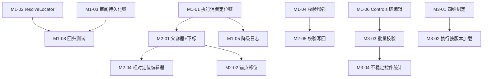

# 元素控件定位 — 实施排期与优先级

> **基准文档**：[元素控件定位页面（未实现）.md](./元素控件定位页面（未实现）.md)、[元素控件定位方式（未实现）.md](./元素控件定位方式（未实现）.md)  
> **现状结论**：Element Picker 拾取工作台可用（约 50–60% §2 落地），平台级稳定性闭环（执行降级、版本隔离、批量预警）未贯通。  
> **排期原则**：先闭环「编辑 → 持久化 → 执行生效」，再补场景能力，最后做平台治理。

---

## 一、优先级定义

| 级别 | 含义 | 判定标准 |
|------|------|----------|
| **P0** | 必须优先 | 不做则定位链/风险数据「写了不生效」，或核心拾取流程不可用 |
| **P1** | 高优先级 | 显著影响用例稳定性，覆盖文档核心场景（相对定位、校验增强） |
| **P2** | 中优先级 | 平台治理与运维效率，可在 P0/P1 稳定后并行 |
| **P3** | 低优先级 / 远期 | 跨端扩展、规范流程、报表类能力 |

---

## 二、里程碑总览

| 里程碑 | 目标 | 建议周期 | 依赖 |
|--------|------|----------|------|
| **M1 闭环** | 定位链从拾取 → 存库 → 执行全链路生效 | 2–3 周 | — |
| **M2 场景** | 列表/弹窗相对定位 + 校验增强 | 2–3 周 | M1 | ✅ 已落地 |
| **M3 治理** | 版本隔离、批量校验、控件池完整维护 | 3–4 周 | M1 | ✅ 已落地 |
| **M4 扩展** | iOS、WebView 上下文、规范与报表 | 4+ 周 | M1–M3 按需 |

**整体建议**：约 **8–12 周** 完成 M1–M3；M4 按资源单列迭代。

---

## 三、详细任务排期

### 阶段 M1：核心闭环（P0）— 建议第 1–3 周

> **目标**：用户在 Picker 里编辑的定位链，保存后执行时真正按优先级降级；审阅/控件池不丢元数据。

| ID | 任务 | 优先级 | 估时 | 涉及模块 | 验收标准 |
|----|------|--------|------|----------|----------|
| M1-01 | **执行引擎消费 `locator_chain`**：`tap_recorded` / 步骤执行按链依次尝试（id → content-desc → xpath → bounds → screen_ratio），命中可见可点击即停 | P0 | 5d | `VisualScriptGenerator.java`、`record_helper.py`、executor 运行时 | 主定位失效时自动命中备用；日志打印 matched_by |
| M1-02 | **`resolveLocator` 读取 `feature_vector.locator_chain`** | P0 | 2d | `ControlPoolService.java` | 控件池解析返回链而非单条 locator |
| M1-03 | **审阅步骤持久化 `locator_chain` + 风险字段** | P0 | 2d | `OperationRecordService.mergeInspectPatch`、前端 `applyToReviewStep` | 应用到审阅后 JSON 含完整链与 risk_level/tags/reasons |
| M1-04 | **校验增强：存在 + 可见 + 可点击** | P0 | 3d | `validate_locators_on_screen`、Picker 校验 UI | 校验结果区分「存在但不可点」；attempts 明细展示 |
| M1-05 | **执行降级日志结构化** | P0 | 2d | executor 日志、可选 TaskDetail 展示 | 每步记录：尝试了哪些定位、哪条命中、失败原因 |
| M1-06 | **Controls.vue 支持定位链编辑** | P0 | 3d | `Controls.vue`、控件池 API | 编辑池条目时可维护链顺序/启停/主定位，与 Picker 一致 |
| M1-07 | **重复控件强制干预** | P0 | 2d | `record_helper.py`、Picker 弹窗 | duplicate 风险时弹窗确认或阻断保存，需人工选主定位 |
| M1-08 | **回归测试** | P0 | 2d | `scripts/verify-recording-p0.py` 等 | 链降级、持久化、校验 12+ 用例通过 |

**M1 小计**：约 **21 人日**（1 后端 + 1 前端 + 0.5 executor 可并行压缩至 2–3 周）

---

### 阶段 M2：场景补全（P1）— 建议第 4–6 周

> **目标**：覆盖文档 §4 相对定位场景；拾取页可配置复杂控件。

| ID | 任务 | 优先级 | 估时 | 涉及模块 | 验收标准 |
|----|------|--------|------|----------|----------|
| M2-01 | **父容器 + 下标定位**：生成 + 编辑 + 执行 | P1 | 5d | `record_helper.py`、Picker UI、executor | 列表项可通过「容器 id + index」定位并执行 |
| M2-02 | **锚点邻位定位**：固定锚点文本/控件 + 相对方向 | P1 | 5d | 同上 | 支持「某文本右侧按钮」类定位 |
| M2-03 | **区域限定定位**：弹窗/模块 bounds 内查找 | P1 | 4d | 同上 | 限定区域内匹配，避免全局重复 |
| M2-04 | **相对定位可视化编辑器** | P1 | 4d | Picker 新面板 | 非开发可配置锚点/容器/区域，预览 XPath |
| M2-05 | **校验写回**：校验结果保存到步骤/控件池 | P1 | 2d | API + Picker/Controls | 最后一次校验时间、结果、matched_by 可查询 |
| M2-06 | **risk_tags 完整展示 + 稳定性评分** | P1 | 2d | Picker、Controls | 标签渲染；0–100 分或 低/中/高 衍生分 |
| M2-07 | **隐藏/遮挡控件过滤** | P1 | 3d | 校验 + 执行匹配 | 不匹配 display=none、bounds 外、不可交互节点 |

**M2 小计**：约 **25 人日**

---

### 阶段 M3：平台治理（P2）— 建议第 7–10 周

> **目标**：文档 §6 版本隔离、§7 批量预警、§8 架构解耦运维能力。

| ID | 任务 | 优先级 | 估时 | 涉及模块 | 验收标准 |
|----|------|--------|------|----------|----------|
| M3-01 | **四维绑定模型**：项目 + 端 + APP 版本 + 环境 | P2 | 4d | DB 迁移、ControlPool 实体 | 控件池创建/查询支持四维筛选 |
| M3-02 | **执行时按任务版本/环境加载定位** | P2 | 3d | Scheduler、`ControlPoolService` | 跑任务自动匹配对应 version_tag/env |
| M3-03 | **批量校验页/API** | P2 | 5d | 新页面 + `/controls/batch-validate` | 按项目/模块/页面一键校验，输出失效/高风险清单 |
| M3-04 | **不稳定控件统计（30 天变更频次）** | P2 | 3d | 变更日志聚合 | 批量校验页置顶高频变更控件 |
| M3-05 | **废弃控件识别与归档** | P2 | 3d | 控件池 status=archived | 连续 N 次校验失败提示归档，不物理删除 |
| M3-06 | **元素关联用例/套件查询** | P2 | 3d | 新 API + Controls 入口 | 修改前可见影响范围 |
| M3-07 | **定位修改全流程留痕** | P2 | 2d | 审计日志 | 操作人、时间、新旧链 diff |
| M3-08 | **Picker 保存流接入版本/环境** | P2 | 2d | Picker 保存弹窗 | 从任务/Case 上下文自动带出 version/env |

**M3 小计**：约 **25 人日**

---

### 阶段 M4：扩展与规范（P3）— 建议第 11 周起

> **目标**：跨端、上下文、规范管控、问题分层报表。

| ID | 任务 | 优先级 | 估时 | 涉及模块 | 验收标准 |
|----|------|--------|------|----------|----------|
| M4-01 | **iOS 控件拾取** | P3 | 8d+ | executor iOS dump、Picker 适配 | iOS 设备可 inspect + 定位链 |
| M4-02 | **WebView 上下文识别与切换** | P3 | 5d | `webview_helper`、Picker 操作栏 | 检测 WebView 后一键切换上下文再拾取 |
| M4-03 | **系统弹窗 / Toast OCR 兜底流程** | P3 | 5d | OCR 集成、Picker | 无控件树场景可走 OCR 定位 |
| M4-04 | **单控件等待规则配置** | P3 | 4d | 步骤/控件池 schema、执行引擎 | 存在/可见/可点击 + 独立 timeout |
| M4-05 | **页面前置等待钩子** | P3 | 3d | launch/navigate 后自动 wait | 等根节点/核心布局就绪再查找 |
| M4-06 | **命名规范 + 控件标签分级** | P3 | 3d | 表单校验、标签 enum | 强制 element_name 规则；静态/动态/弹窗标签 |
| M4-07 | **控件编辑权限分级** | P3 | 2d | RBAC | 生产环境核心控件仅管理员可改 |
| M4-08 | **定位失败分层报表（§11）** | P3 | 4d | 报表页 | 时序/设备/永久失效分类统计 |
| M4-09 | **UiSelector 表达式生成（Android 原生）** | P3 | 5d | record_helper | 链中增加 uiselector 类型，执行走原生 API |

**M4 小计**：约 **39+ 人日**（可按子项拆独立版本）

---

## 四、推荐实施顺序（冲刺视角）

### Sprint 1（Week 1–2）— 「写了要生效」✅ 已落地

1. ~~M1-01 执行引擎消费定位链~~ ✅
2. ~~M1-03 审阅步骤持久化链~~ ✅
3. ~~M1-02 resolveLocator 读 feature_vector~~ ✅
4. ~~M1-04 校验增强~~ ✅

### Sprint 2（Week 3）— 「可维护可回归」✅ 已落地

5. ~~M1-06 Controls 定位链编辑~~ ✅
6. ~~M1-07 重复控件强制干预~~ ✅
7. ~~M1-05 降级日志~~ ✅（`ATP_LOCATOR_ATTEMPT/MATCH/FAIL`）
8. ~~M1-08 回归测试~~ ✅（`scripts/verify-locator-chain-m1.py`）

### Sprint 3（Week 4–5）— 「复杂场景」✅ 已落地

9. ~~M2-01 父容器 + 下标~~ ✅
10. ~~M2-03 区域限定~~ ✅
11. ~~M2-06 risk_tags + 评分~~ ✅

### Sprint 4（Week 6）— 「锚点与过滤」✅ 已落地

12. ~~M2-02 锚点邻位~~ ✅
13. ~~M2-04 相对定位编辑器~~ ✅
14. ~~M2-07 隐藏/遮挡过滤~~ ✅
15. ~~M2-05 校验写回~~ ✅

### Sprint 5–6（Week 7–10）— 「平台治理」✅ 已落地

15. ~~M3-01 四维绑定模型~~ ✅
16. ~~M3-02 执行按版本/环境加载~~ ✅
17. ~~M3-03 批量校验页/API~~ ✅
18. ~~M3-04 不稳定控件统计~~ ✅
19. ~~M3-05 废弃控件归档~~ ✅
20. ~~M3-06 套件关联查询~~ ✅
21. ~~M3-07 定位修改留痕~~ ✅
22. ~~M3-08 Picker 保存上下文~~ ✅

### Sprint 7+（Week 11+）— 「扩展」✅ 已落地

16. ~~M4-01 iOS 控件拾取~~ ✅
17. ~~M4-02 WebView 上下文切换~~ ✅
18. ~~M4-03 OCR 兜底流程~~ ✅
19. ~~M4-04 单控件等待规则~~ ✅
20. ~~M4-05 页面前置等待钩子~~ ✅
21. ~~M4-06 命名规范 + 控件标签~~ ✅
22. ~~M4-07 控件编辑权限分级~~ ✅
23. ~~M4-08 定位失败分层报表~~ ✅
24. ~~M4-09 UiSelector 表达式~~ ✅（`scripts/verify-control-pool-m4.py`）

---

## 五、依赖关系简图

---

## 六、风险与缓冲

| 风险 | 影响 | 缓解 |
|------|------|------|
| executor 与 Java 后端双栈改动不同步 | M1 闭环延迟 | 每个 M1 任务配对接口契约 + 集成测试 |
| UI dump 性能 / tap_priority 阻塞 | 识别/校验慢 | 保留「操控/识别」模式拆分；补 `_wait_until_dump_allowed` |
| 相对定位表达式过长难维护 | M2 使用率低 | 编辑器限制层级 ≤3；强制容器限定 |
| 四维版本模型牵涉历史数据迁移 | M3 上线风险 | 默认值兼容旧数据；version_tag 可选过渡 |

**建议缓冲**：每里程碑预留 **15–20%** 时间用于联调与 Bugfix。

---

## 七、当前已完成（不计入排期）

以下能力已在 Element Picker / executor 落地，排期中的任务是在此基础上补全：

- Android 投屏 + UI 树刷新 + 识别控件模式拆分  
- 定位链 UI（推荐/主定位/排序/启停/校验/保存控件池）  
- 风险等级 + reasons 展示；screen_ratio 兜底  
- 禁止 absolute_xpath 入链；动态 text 过滤  
- `/screen/inspect`、`/screen/validate-locator`、`/screen/warm-ui`  
- 控件池 `feature_vector` 存储 locator_chain（执行未消费）

---

## 八、资源建议

| 角色 | M1 | M2 | M3 | M4 |
|------|----|----|----|----|
| 后端 Java | 1 | 0.5 | 1 | 0.5 |
| 前端 Vue | 1 | 1 | 0.5 | 0.5 |
| Python executor | 0.5 | 1 | 0.5 | 1 |
| 测试 | 0.5 | 0.5 | 0.5 | 0.5 |

---

## 九、一页纸优先级速查

| 优先级 | 必做项（Top 5） |
|--------|-----------------|
| **P0** | ① 执行消费定位链 ② 审阅/池持久化链 ③ 校验可见可点击 ④ Controls 链编辑 ⑤ 重复控件阻断 |
| **P1** | 父容器+下标、锚点邻位、区域限定、risk_tags 展示、隐藏控件过滤 |
| **P2** | 四维版本隔离、批量校验页、不稳定控件统计、废弃归档、影响范围查询 |
| **P3** | iOS 拾取、WebView 切换、单控件等待、失败分层报表、UiSelector |

---

*文档版本：v1.3 · 更新日期：2026-07-13 · M1/M2/M3/M4 已闭环。*
